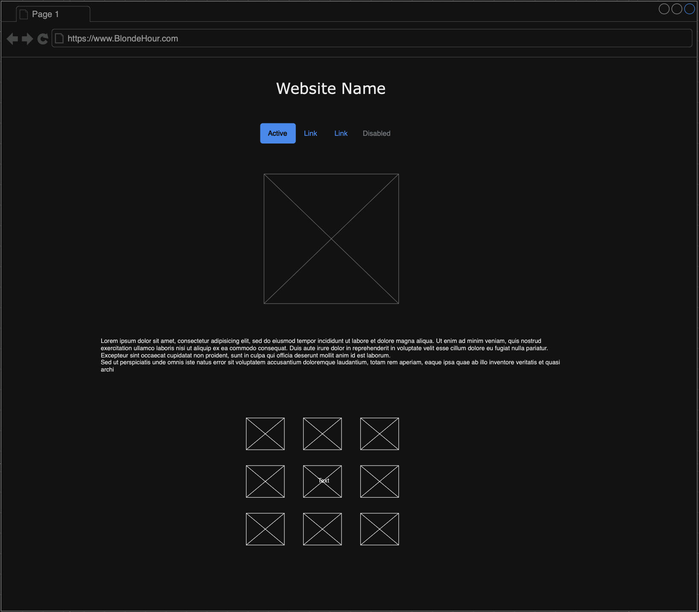
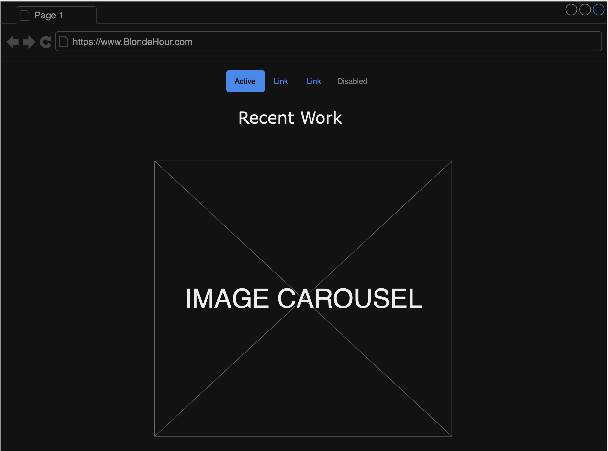
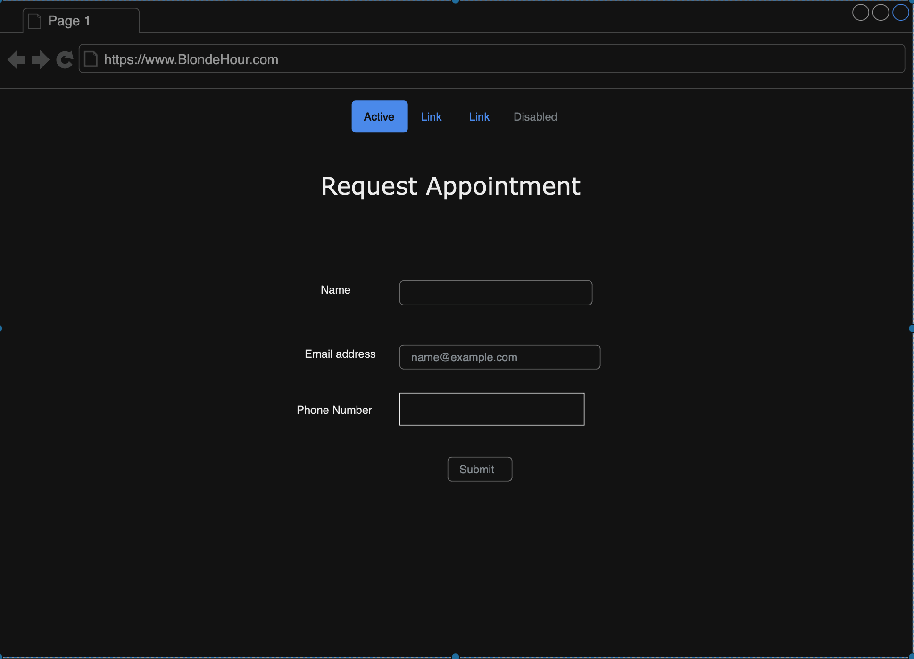

# Martin Ramirez

# Description
The website I created is for my fiance Ashley who is a hairstylist. Concept is to help clients request appointments and get information. Clients are able to view recent work.

# User Stories :
1. As a customer  I want to request an appointment so I can change my hairstyle.
2. As a new customer I want to see starting prices so I have an idea of how much I will spend.
3. As a current customer I want to share your website so my friend can get matching hair color.

# WireFreames: 

Instructions:
Client is able to navigate website using the NavBar.

# Technologies Used 
1. HTML
2. CSS
3. Github
4. Bootstrap
5. Google Fonts
6. Bootswatch
7. Code Validation

# Ideas for future improvement:
1. Practice coding more.
2. Repeat courses constantly.
3. Ask more questions.

